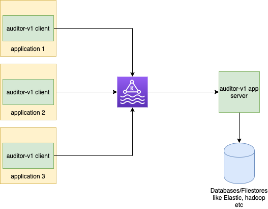

# Auditor-v1
[](https://github.com/lowes/auditor/actions/workflows/gradle-publish.yml)
[](https://search.maven.org/search?q=g:io.github.lowes%20AND%20a:auditor*)
[](https://github.com/lowes/auditor/blob/main/LICENSE)

[](https://s01.oss.sonatype.org/content/repositories/snapshots/io/github/lowes/auditor-client/)
[](https://github.com/lowes/auditor/pulls?q=is%3Apr+is%3Aclosed)
[](https://codeclimate.com/github/lowes/auditor)
[](https://codeclimate.com/github/lowes/auditor)
[](https://codeclimate.com/github/lowes/lowes/issues)
[](https://codeclimate.com/github/lowes/auditor)
[](https://conventionalcommits.org)

Solves the audit needs for any JVM based application.
### Motivation
Auditing is a cross-cutting concerns of many applications supporting business process/workflows.
There are some solutions out there like [Javers](https://javers.org/), [Audit4J](https://github.com/audit4j), [Log4j Audit](https://logging.apache.org/log4j-audit/latest/index.html) etc.. that aims to provide auditing functionality for java applications. 
However, most of them focus on capturing the audit information and storing in some sort of database or filesystem.
While this is desirable in most traditional use cases, it becomes a challenge when microservices are serving high request throughput.
There are other challenges when aggregating audit information generated from hundreds of microservices.
In such cases, there's a need to decouple audits from business flows yet guarantee eventual consistency and performance.
Auditor-v1 is an attempt to solve this.It offers a client library, and an app server that captures audit events at high throughput in distributed way.
<br/><br/>
### Highlights
- It's easily pluggable: A client library that can be integrated into any jvm application, directly or via spring boot starter module.
Client library offers simple one liner api for seamless integration.
- It's async: Auditing happens asynchronously on a separate thread pool with retries to ensure eventual consistency.
- It's efficient: Auditor uses [Project reactor](https://projectreactor.io/) behind the scene to utilize system's hardware efficiently.
- It's performant: Auditor uses [jackson-afterburner](https://github.com/FasterXML/jackson-modules-base/tree/master/afterburner) for serialization needs which is both fast and performant.
- It's scalable: It leverages [Kafka](https://kafka.apache.org/) as event streaming platform so benefit from the inherent scalability feature of kafka. 
- It's configurable: Highly configurable to meet different application custom needs ranging from logging, filtering, decorating(static data and dynamic templating) audit events.
 Supports both startup as well as runtime/dynamic configurations.
<br/><br/>
### Architecture

<br/><br/>
### Modules
The project is composed of following modules:
- [core](./core): Contains reusable code across other modules, primarily mappers, openapi spec auto-generated code etc.
- [client](./client): Contains API and implementation code for the auditor library that will get plugged into applications thats needs audit feature.
- [client-spring-boot-starter](./client-spring-boot-starter): It's a spring boot starter over client API(s). Useful for application that uses spring boot.
- [client-example](./client-example): Example application to showcase standalone client usage.
- [client-example-springboot](./client-example-springboot): Example application to showcase spring boot starter usage.
- [app](./app): Contains deployable app that will listen to kafka and inserts the audit events and logs to elastic search.
<br/><br/>
### Integration:
The modules are available on [maven central repo](https://search.maven.org/search?q=g:io.github.lowes%20AND%20a:auditor*). Just point your maven/gradle to maven central and you should be able to download the relevant modules.
##### Gradle:
```
repositories {
    mavenCentral()
}
```
##### Maven:
```
<repositories>
  <repository>
    <id>central</id>
    <name>Maven Central</name>
    <layout>default</layout>
    <url>https://repo1.maven.org/maven2</url>
  </repository>
</repositories>
```
<br/><br/>
### Using auditor-v1 client library
It can be integrated in either of following two ways.
- #### Standalone mode:
   Refer the [client module's README.md](./client/README.md) for how to use the client in standalone mode
- #### Spring boot starter mode:
    Spring boot starter module is built for applications that uses spring boot framework and comes with additional benefit of pre-initialized `Auditor` instance.
    Refer the [client-spring-boot-starter module's README.md](./client-spring-boot-starter/README.md) for how to use the spring-boot-starter mode
 <br/><br/>
### Examples: Integration & Configurations
you can refer to the example modules:
- [client-example](./client-example),
- [client-example-springboot](./client-example-springboot)

on how to integrate with auditor client APIs.
Auditor client configurations: [AuditorEventConfig.kt](./client/src/main/kotlin/com/lowes/auditor/client/entities/domain/AuditorEventConfig.kt)
can be provided both at startup time and during runtime.
You can also refer the `application.yml` in example modules to understand how to use different configurations at startup time.
Runtime configurations can be also seen in examples modules code.

Refer the [client-spring-boot-starter's README.md](./client-spring-boot-starter/README.md) to see full configuration options.
<br/><br/>
 
### Using auditor-v1 app server
Auditor server is present inside `app` module. Refer the [app module's README.md](./app/README.md) for how to use the app server.
<br/><br/>

### Contributing: local-setup, development and testing:
Please refer to our [Contributing](./CONTRIBUTING.md) page for more details.

For any queries/community support reach out to stack overflow channel: <//todo>


#### Running the app sever
Refer the [app module's README.md](./app/README.md) for how to run the app server locally
